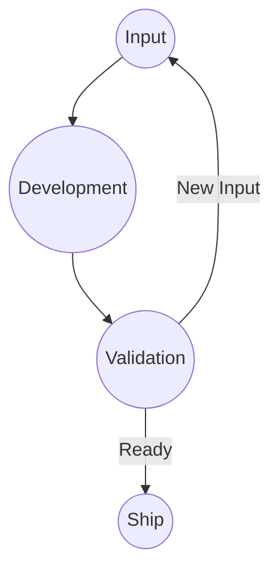

# Framework Diagram

The framework diagram is the visual source of truth for the Ship It! Framework.

## Principles

- Every change starts as Input.
- Every change goes through Development.
- Every change is validated.
- Successful validation leads to Ship.
- Failed validation creates new Input.

The workflow is the anchor of the framework. Everything else is implementation detail.
