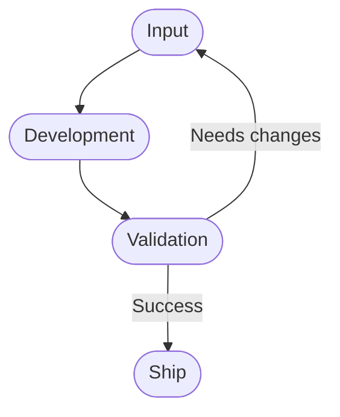

# Framework Diagram

This document contains the source of truth for the Ship It! Framework diagram.

## Principles

- Every change starts as Input.
- Every change goes through Development.
- Every change is validated.
- Successful validation leads to Ship.
- Failed validation creates new Input.

Everything else is implementation detail.