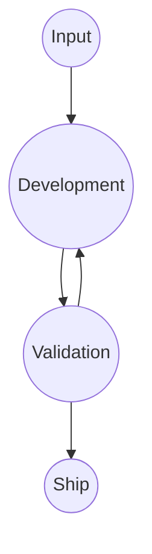

# Framework Graph

The framework graph is the visual source of truth for the Ship It! Framework. It represents four concepts and the relationships between them.

```mermaid
flowchart TD

I((Input))

D((Development))

V((Validation))

S((Ship))

I --> D
D --> V
V --> S
V --> D
```

## Principles

- Every change starts as Input.
- Every change goes through Development.
- Every change is validated.
- Validation can lead to Ship.
- Validation can also return work to Development.

The workflow is the anchor of the framework. Everything else is implementation detail.
