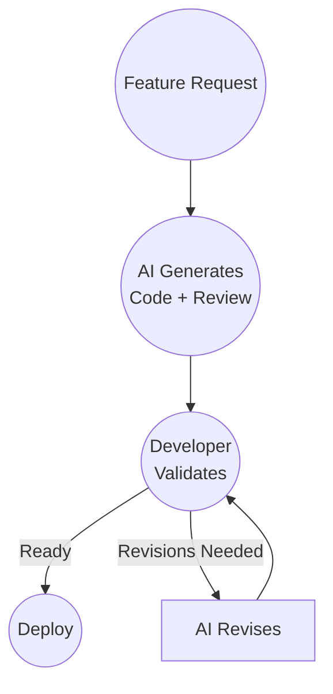

# AI-Assisted Development

## Context

A developer uses AI code generation to assist with development.

AI writes code based on prompts and specifications.

The developer reviews, tests, and validates the AI-generated code before shipping.

## Workflow

## Validation

Developer validation of AI-generated code:

- Review code for correctness
- Run test suite
- Manual testing
- Verify behavior matches specification

Human judgment remains essential.

## Observations

The workflow didn't change.

Only the Development implementation changed.

AI assists with code generation, but humans still perform validation.

The framework remains:

Input → Development → Validation → Ship

## Ship It! Compliance

✓ Input: Feature request enters as Input

✓ Development: AI generates code (human assists)

✓ Validation: Developer validates the generated code

✓ Ship: Validated code is deployed

Status: PASS
