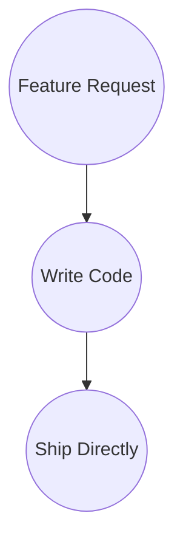
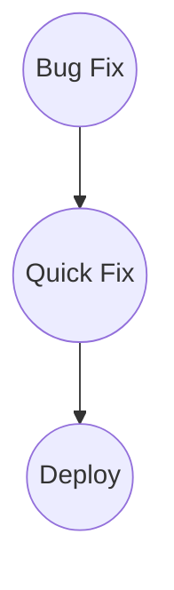
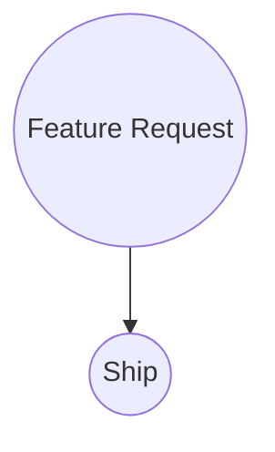
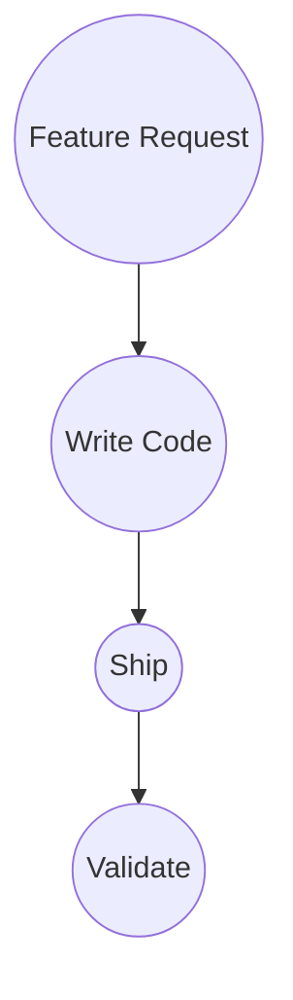
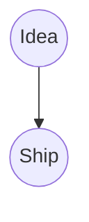

# Counter Examples

These examples show workflows that violate the Ship It! Framework.

They demonstrate what happens when framework steps are skipped or reordered.

## Ship Before Validation

### Context

A team ships code to production without validation.

They believe their development process is good enough.

### Workflow

### Why This Fails

Validation is skipped entirely.

There is no independent verification before shipping.

Problems reach users without detection.

The framework breaks.

### Ship It! Compliance

✓ Input: Feature request

✓ Development: Code is written

✗ Validation: SKIPPED - Code goes directly to production

✗ Ship: Code shipped without validation

Status: FAIL

---

## Skip Validation Step

### Context

A developer believes their code is correct.

They skip code review, testing, and validation.

They push directly to production.

### Workflow

### Why This Fails

The framework requires independent verification.

Skipping validation means no verification happens.

Edge cases and unintended consequences reach users.

### Ship It! Compliance

✓ Input: Bug identified

✓ Development: Fix implemented

✗ Validation: SKIPPED - No independent review or testing

✗ Ship: Unvalidated code shipped

Status: FAIL

---

## Skip Development

### Context

A team receives a feature request and immediately ships it without building anything.

This is obviously broken.

### Workflow

### Why This Fails

Development creates value.

Skipping development means no solution is built.

Nothing is shipped.

The workflow is broken at the core.

### Ship It! Compliance

✓ Input: Feature request

✗ Development: SKIPPED - No work happens

✗ Validation: Cannot validate nothing

✗ Ship: Nothing to ship

Status: FAIL

---

## Validation After Ship

### Context

A team ships code to production first.

Then they run tests to verify quality.

This is backwards.

### Workflow

### Why This Fails

Validation must happen before shipping.

If issues are found after shipping, users have already been affected.

The order matters.

### Ship It! Compliance

✓ Input: Feature request

✓ Development: Code written

✗ Validation: Happens AFTER ship (wrong order)

✗ Ship: Shipped before validation

Status: FAIL

---

## Multiple Skips

### Context

A team skips both Development and Validation.

They have an idea and ship it immediately.

### Workflow

### Why This Fails

No development means no actual work.

No validation means no verification.

Shipping happens with nothing built and nothing verified.

Complete framework violation.

### Ship It! Compliance

✗ Input: Idea (not formal Input)

✗ Development: SKIPPED - No solution built

✗ Validation: SKIPPED - No verification

✗ Ship: Shipped nothing

Status: FAIL

---

## Summary

Counter examples show that:

- Validation cannot be skipped
- Validation must happen before Ship
- Development cannot be skipped
- The order of steps matters
- All four steps are required

The Ship It! Framework is not optional.

It is the minimum required for safe software delivery.
