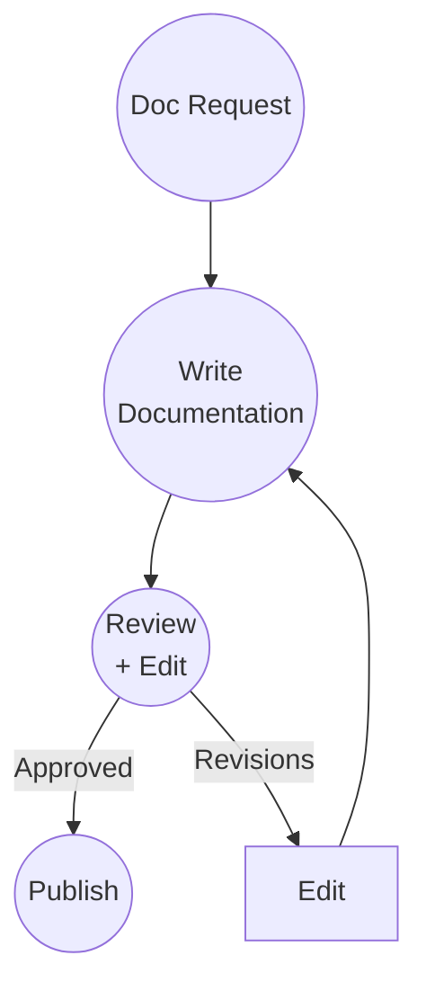

# Documentation

## Context

The framework treats documentation as work.

Documentation is requested, written, reviewed, and shipped.

It follows the same workflow as code.

## Workflow

## Validation

Documentation validation:

- Technical accuracy review
- Clarity and completeness check
- Style guide compliance
- Example verification

Validation ensures documentation quality.

## Observations

The workflow didn't change.

Only the work type changed.

Documentation is Input. Writers are Development. Editors are Validation. Publishing is Ship.

The framework remains:

Input → Development → Validation → Ship

## Ship It! Compliance

✓ Input: Documentation request

✓ Development: Writer creates documentation

✓ Validation: Editor reviews and validates

✓ Ship: Documentation is published

Status: PASS
