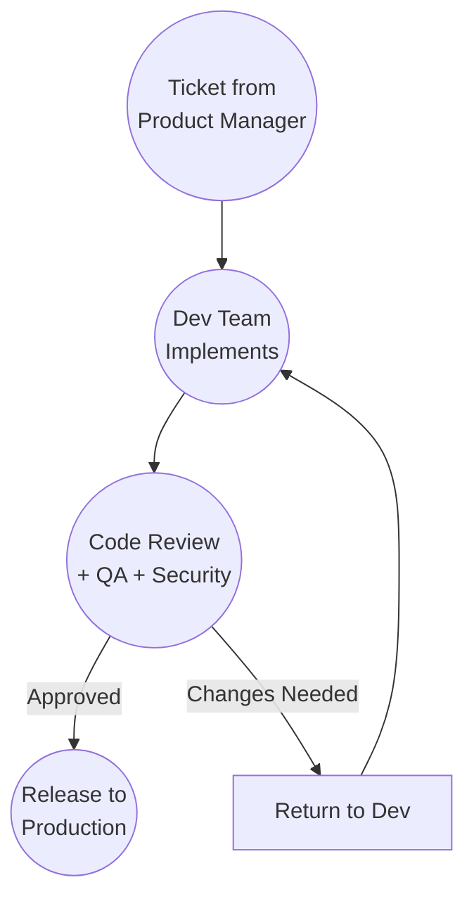

# Enterprise

## Context

A large organization with multiple teams.

Work flows through development teams, code review processes, QA departments, and deployment pipelines.

Multiple people are involved at each stage.

## Workflow

## Validation

Formal validation including:

- Code review by other developers
- QA testing
- Security scanning
- Compliance checks
- Staging environment verification

Validation happens before the release pipeline.

## Observations

The workflow didn't change.

Only the Validation implementation changed.

Multiple teams and formal processes replaced self-review and testing.

The framework remains:

Input → Development → Validation → Ship

## Ship It! Compliance

✓ Input: Tickets from product management

✓ Development: Development team implements features

✓ Validation: Code review, QA, security, compliance verify work

✓ Ship: Release pipeline deploys to production

Status: PASS
