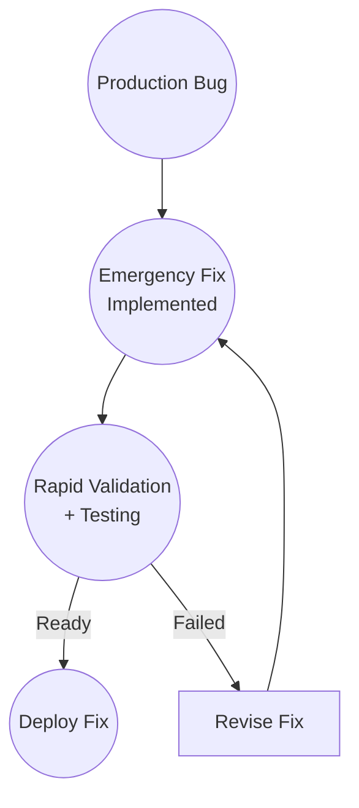

# Hotfix

## Context

A production bug is discovered.

It impacts users immediately.

The team needs to fix it quickly while still maintaining quality.

## Workflow

## Validation

Fast but rigorous validation:

- Automated tests confirm fix
- Manual verification in staging
- Sanity checks on related code
- All done rapidly

Speed increases, but validation does not disappear.

## Observations

The workflow didn't change.

Only the timeline and Validation rigor changed.

The fix still goes through Input → Development → Validation → Ship.

Even under pressure, validation cannot be skipped.

## Ship It! Compliance

✓ Input: Production bug is reported as Input

✓ Development: Team implements emergency fix

✓ Validation: Rapid but independent validation confirms fix

✓ Ship: Fix is deployed to production

Status: PASS
