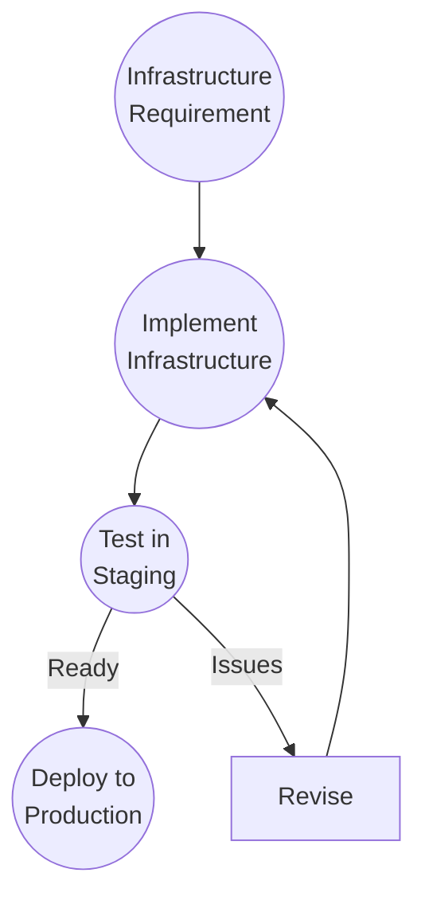

# Infrastructure

## Context

Infrastructure work (deployment pipelines, database migrations, server configuration) follows the same framework as feature development.

Infrastructure changes must be validated before they affect production systems.

## Workflow

## Validation

Infrastructure validation:

- Staging environment testing
- Performance verification
- Rollback procedure testing
- Security validation
- Team review

Validation confirms safety before production deployment.

## Observations

The workflow didn't change.

Only the work domain changed from code to infrastructure.

The framework treats infrastructure changes identically to feature development.

Input → Development → Validation → Ship

## Ship It! Compliance

✓ Input: Infrastructure requirement or change request

✓ Development: Infrastructure team implements change

✓ Validation: Staging testing and review validate safety

✓ Ship: Validated change is deployed to production

Status: PASS
