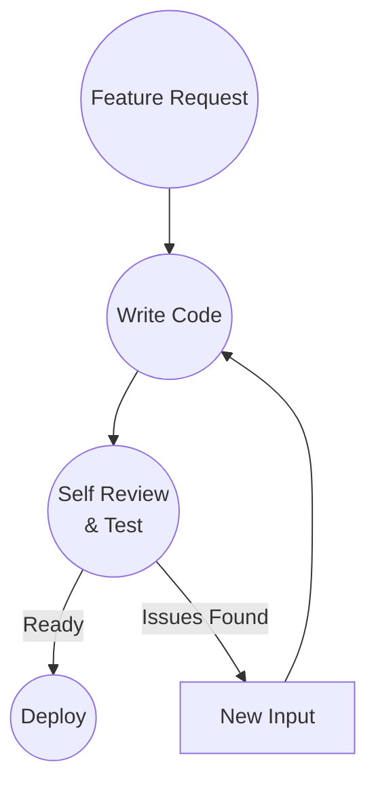

# Solo Developer

## Context

A single developer works on a feature.

They write code, run tests, and review their own work before shipping.

This is a common scenario in small teams or solo projects.

## Workflow

## Validation

Self review and testing.

The developer validates their own work.

Validation may include:

- Running the test suite
- Code review of their own changes
- Manual testing
- Static analysis tools

The key is independent verification that the work is ready.

## Observations

The workflow didn't change.

Only the Validation implementation changed.

The developer performs validation themselves, but it is still independent verification before shipping.

The framework remains:

Input → Development → Validation → Ship

## Ship It! Compliance

✓ Input: Feature request enters as Input

✓ Development: Developer writes code

✓ Validation: Developer validates their own work independently

✓ Ship: Validated code is deployed

Status: PASS
